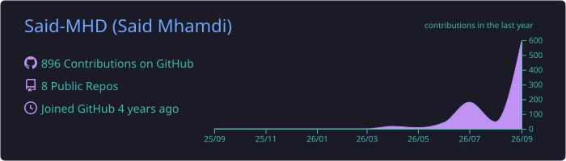
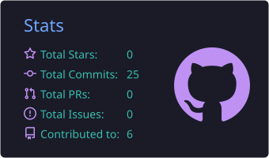
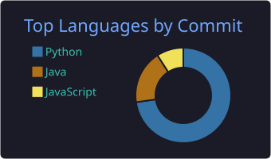

<!-- ═══════════════════════════════ BANNER ═══════════════════════════════ -->
<p align="center">
  
</p>

<h1 align="center">Hi, I'm Said Mhamdi 👋</h1>

<p align="center">
  <a href="https://git.io/typing-svg">
    
  </a>
</p>

<p align="center">
  <a href="https://www.linkedin.com/in/said-mhamdi-6785a820a"></a>
  <a href="mailto:mhamdisaid89@gmail.com"></a>
  <a href="https://github.com/Said-MHD?tab=repositories"></a>
  
</p>

<p align="center">
  
</p>

<br/>

<!-- ═══════════════════════════════ ABOUT ═══════════════════════════════ -->
## 🧑‍💻 About me

```python
class SaidMhamdi:
    role      = "Computer Engineering Student"
    focus     = ["Full-Stack Development", "Data Engineering", "Business Intelligence"]
    backend   = ["Python", "FastAPI", "Java", "Spring", "PostgreSQL"]
    frontend  = ["Next.js", "React", "TypeScript"]
    devops    = ["Docker", "Caddy", "Git", "GitHub"]
    currently = "Building Tukhnanutha Dashboard — a strategic supervision platform"
    principle = "Data first, then insight, then intelligence."

    def say_hi(self):
        return "Thanks for stopping by — let's build something useful together!"


if __name__ == "__main__":
    me = SaidMhamdi()
    print(f"👨‍💻 {me.role}")
    print(f"🎯 Focus     : {' · '.join(me.focus)}")
    print(f"⚙️  Backend   : {' · '.join(me.backend)}")
    print(f"🎨 Frontend  : {' · '.join(me.frontend)}")
    print(f"🐳 DevOps    : {' · '.join(me.devops)}")
    print(f"🚀 Currently : {me.currently}")
    print(f"💡 Principle : {me.principle}")
    print()
    print(f"👋 {me.say_hi()}")
```

<b>▶️ Output</b>

```console
$ python said_mhamdi.py

👨‍💻 Computer Engineering Student
🎯 Focus     : Full-Stack Development · Data Engineering · Business Intelligence
⚙️  Backend   : Python · FastAPI · Java · Spring · PostgreSQL
🎨 Frontend  : Next.js · React · TypeScript
🐳 DevOps    : Docker · Caddy · Git · GitHub
🚀 Currently : Building Tukhnanutha Dashboard — a strategic supervision platform
💡 Principle : Data first, then insight, then intelligence.

👋 Thanks for stopping by — let's build something useful together!
```

<!-- ═══════════════════════════════ WHAT I DO ═══════════════════════════════ -->
## ⚡ What I do


- 🏗️ **Backend engineering** — clean REST APIs with FastAPI and Spring, versioned database migrations, typed validation
- 🎨 **Frontend** — Next.js and React interfaces behind a secure BFF layer
- 🔐 **Security by design** — JWT in HttpOnly cookies, role-based access control, full audit trail
- 🐳 **DevOps** — Docker Compose, HTTPS gateway, healthchecks, backup &amp; restore
- 🧪 **Quality** — automated tests with pytest and Playwright, evidence before every release
- 📊 **Data &amp; BI** — data quality and governance first, then dashboards, then decision support

**How I work:** short sprints → targeted tests → evidence pack → **GO / NO-GO** review → release.

<br clear="right"/>

<!-- ═══════════════════════════════ FEATURED ═══════════════════════════════ -->
## 🚀 Currently building

> **Tukhnanutha Dashboard** — a strategic supervision and governance platform for a multi-entity group.
> Built with FastAPI, PostgreSQL, Next.js and Docker.

<p>
  
  
</p>

<!-- ═══════════════════════════════ STACK ═══════════════════════════════ -->
## 🛠️ Tech stack

<table align="center">
  <tr>
    <td align="center" width="140"><b>Backend</b></td>
    <td></td>
  </tr>
  <tr>
    <td align="center"><b>Frontend</b></td>
    <td></td>
  </tr>
  <tr>
    <td align="center"><b>DevOps &amp; Tools</b></td>
    <td></td>
  </tr>
  <tr>
    <td align="center"><b>Data &amp; Testing</b></td>
    <td>
      
      
      
      
      
    </td>
  </tr>
</table>

<!-- ═══════════════════════════════ PROJECTS ═══════════════════════════════ -->
## 📂 Other projects

<table>
  <tr>
    <td width="50%" valign="top">
      <h3>🗂️ <a href="https://github.com/Said-MHD/smart-file-organizer">smart-file-organizer</a></h3>
      <p>Automatically sorts and organises files into folders by type and rules.</p>
      
      
    </td>
    <td width="50%" valign="top">
      <h3>🤖 <a href="https://github.com/Said-MHD/github-bot">github-bot</a></h3>
      <p>Automation bot for repetitive GitHub tasks.</p>
      
      
    </td>
  </tr>
</table>

<!-- ═══════════════════════════════ STATS ═══════════════════════════════ -->
## 📈 GitHub activity

<p align="center">
  
</p>

<!-- Cards below are generated inside this repository by .github/workflows/profile.yml -->
<p align="center">
  
</p>
<p align="center">
  
  
</p>

<!-- ═══════════════════════════════ SNAKE ═══════════════════════════════ -->
<h3 align="center">🐍 Snake II — Nokia 3310 edition</h3>

<p align="center">
  
</p>

<p align="center"><sub>My contribution history, eaten one commit at a time.</sub></p>

<!-- ═══════════════════════════════ FOOTER ═══════════════════════════════ -->
<br/>

<p align="center">
  <i>“Data first, then insight, then intelligence.”</i>
</p>


