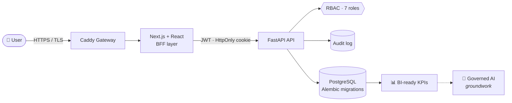

<!-- ============================ BANNER ============================ -->
<p align="center">
  
</p>

<h1 align="center">Hi, I'm Said Mhamdi </h1>

<p align="center">
  <a href="https://git.io/typing-svg">
    
  </a>
</p>

<p align="center">
  <a href="https://www.linkedin.com/in/said-mhamdi-6785a820a"></a>
  <a href="mailto:your.email@example.com"></a>
  <a href="https://github.com/Said-MHD?tab=repositories"></a>
  
</p>

<p align="center">
  
</p>

<!-- ============================ ABOUT ============================ -->
## 🧑‍💻 About me

```python
class SaidMhamdi:
    role      = "Computer Engineering Student"
    focus     = ["Full-Stack Development", "Data Engineering", "Business Intelligence"]
    backend   = ["Python", "FastAPI", "Java", "Spring", "PostgreSQL"]
    frontend  = ["Next.js", "React", "TypeScript"]
    devops    = ["Docker", "Caddy", "Git", "GitHub"]
    currently = "Building Tukhnanutha Dashboard — a strategic supervision platform"
    principle = "Data first, then insight, then intelligence."

    def say_hi(self):
        return "Thanks for stopping by — let's build something useful together!"
```

- 🏗️ I turn complex business needs into **reliable, secure and tested** software
- 📊 I care about **data quality and governance** before dashboards and before AI
- 🧪 I work in **sprints** with clear evidence and **GO / NO-GO** reviews before each release
- 🌱 Currently deepening **cloud, DevOps and BI** skills

<!-- ============================ FEATURED ============================ -->
## 🚀 Featured project — Tukhnanutha Dashboard

> A backend-first platform for **strategic supervision and governance** of a multi-entity group: KPIs, risks, compliance, finance, alerts, incidents and operational steering.



<table>
  <tr>
    <td><b>🔐 Security</b></td>
    <td>JWT in HttpOnly cookies · role-based access control · full audit trail</td>
  </tr>
  <tr>
    <td><b>🐳 Infrastructure</b></td>
    <td>Docker Compose · Caddy reverse proxy with HTTPS · healthchecks · backup &amp; restore</td>
  </tr>
  <tr>
    <td><b>🧪 Quality</b></td>
    <td>pytest (backend) · Playwright (end-to-end) · evidence pack for every sprint</td>
  </tr>
  <tr>
    <td><b>📊 Data</b></td>
    <td>Strict separation of demo / simulated / real data · KPI definitions, thresholds and snapshots</td>
  </tr>
</table>

<!-- ============================ STACK ============================ -->
## 🛠️ Tech stack

<p align="center">
  <b>Backend</b><br/><br/>
  
</p>

<p align="center">
  <b>Frontend</b><br/><br/>
  
</p>

<p align="center">
  <b>DevOps &amp; Tools</b><br/><br/>
  
</p>

<p align="center">
  <b>Data &amp; Testing</b><br/><br/>
  
  
  
  
  
</p>

<!-- ============================ PROJECTS ============================ -->
## 📂 Other projects

<p align="center">
  <a href="https://github.com/Said-MHD/smart-file-organizer">
    
  </a>
  <a href="https://github.com/Said-MHD/github-bot">
    
  </a>
</p>

<!-- ============================ STATS ============================ -->
## 📈 GitHub activity

<p align="center">
  
  
</p>

<p align="center">
  
</p>

<p align="center">
  
</p>

<!-- Snake animation: generated by .github/workflows/snake.yml -->
<p align="center">
  <picture>
    <source media="(prefers-color-scheme: dark)" srcset="https://raw.githubusercontent.com/Said-MHD/Said-MHD/output/github-contribution-grid-snake-dark.svg" />
    
  </picture>
</p>

<!-- ============================ FOOTER ============================ -->
<p align="center">
  <i>“Data first, then insight, then intelligence.”</i>
</p>


